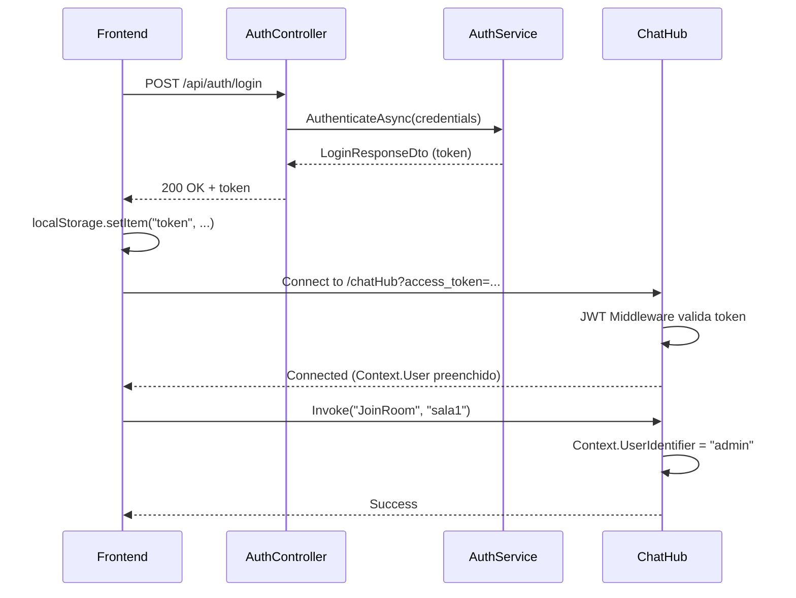

# ?? Guia Completo de Autenticação JWT

## ?? Visão Geral

Este sistema usa **JWT (JSON Web Tokens)** para autenticação. O fluxo completo é:

1. **Frontend** faz login via HTTP POST ? recebe um token JWT
2. **Frontend** armazena o token (localStorage/sessionStorage)
3. **Frontend** usa o token em todas as requisições:
   - **HTTP**: Header `Authorization: Bearer {token}`
   - **SignalR**: Query string `?access_token={token}`

---

## ?? Usuários de Demonstração

Para testes, o sistema já vem com usuários pré-cadastrados em memória:

| Username | Password |
|----------|----------|
| `admin` | `admin123` |
| `usuario1` | `senha123` |
| `usuario2` | `senha456` |
| `teste` | `teste123` |

> ?? **IMPORTANTE:** Em produção, substitua por um banco de dados real com senhas hasheadas (BCrypt/Argon2).

---

## ?? Fluxo de Autenticação Completo

### 1?? Login (Frontend ? Backend)

**Endpoint:** `POST /api/auth/login`

**Request:**
```json
{
  "username": "admin",
  "password": "admin123"
}
```

**Response (200 OK):**
```json
{
  "token": "eyJhbGciOiJIUzI1NiIsInR5cCI6IkpXVCJ9...",
  "username": "admin",
  "expiresAt": "2024-01-15T18:30:00Z",
  "tokenType": "Bearer"
}
```

**Response (401 Unauthorized):**
```json
{
  "message": "Usuário ou senha inválidos"
}
```

---

### 2?? Validar Token

**Endpoint:** `GET /api/auth/validate`

**Headers:**
```
Authorization: Bearer {token}
```

**Response (200 OK):**
```json
{
  "isValid": true,
  "username": "admin",
  "userId": "admin",
  "claims": [
    { "type": "sub", "value": "admin" },
    { "type": "jti", "value": "..." },
    { "type": "http://schemas.xmlsoap.org/ws/2005/05/identity/claims/name", "value": "admin" }
  ]
}
```

---

## ?? Exemplos de Código Frontend

### React/Next.js - Serviço de Autenticação

```typescript
// lib/auth-service.ts
const API_URL = "https://localhost:7xxx"; // Ajuste para sua porta

export interface LoginCredentials {
  username: string;
  password: string;
}

export interface LoginResponse {
  token: string;
  username: string;
  expiresAt: string;
  tokenType: string;
}

export class AuthService {
  private static TOKEN_KEY = "access_token";
  private static USERNAME_KEY = "username";

  /**
   * Faz login e armazena o token
   */
  static async login(credentials: LoginCredentials): Promise<LoginResponse> {
    const response = await fetch(`${API_URL}/api/auth/login`, {
      method: "POST",
      headers: {
        "Content-Type": "application/json",
      },
      body: JSON.stringify(credentials),
    });

    if (!response.ok) {
      const error = await response.json();
      throw new Error(error.message || "Login falhou");
    }

    const data: LoginResponse = await response.json();

    // Armazena o token no localStorage
    this.setToken(data.token);
    this.setUsername(data.username);

    console.log("? Login bem-sucedido:", data.username);
    return data;
  }

  /**
   * Faz logout (remove o token)
   */
  static logout(): void {
    localStorage.removeItem(this.TOKEN_KEY);
    localStorage.removeItem(this.USERNAME_KEY);
    console.log("? Logout realizado");
  }

  /**
   * Retorna o token armazenado
   */
  static getToken(): string | null {
    if (typeof window === "undefined") return null;
    return localStorage.getItem(this.TOKEN_KEY);
  }

  /**
   * Retorna o username armazenado
   */
  static getUsername(): string | null {
    if (typeof window === "undefined") return null;
    return localStorage.getItem(this.USERNAME_KEY);
  }

  /**
   * Armazena o token
   */
  static setToken(token: string): void {
    localStorage.setItem(this.TOKEN_KEY, token);
  }

  /**
   * Armazena o username
   */
  static setUsername(username: string): void {
    localStorage.setItem(this.USERNAME_KEY, username);
  }

  /**
   * Verifica se o usuário está autenticado
   */
  static isAuthenticated(): boolean {
    return this.getToken() !== null;
  }

  /**
   * Valida o token com o backend
   */
  static async validateToken(): Promise<boolean> {
    const token = this.getToken();
    if (!token) return false;

    try {
      const response = await fetch(`${API_URL}/api/auth/validate`, {
        headers: {
          Authorization: `Bearer ${token}`,
        },
      });

      return response.ok;
    } catch {
      return false;
    }
  }

  /**
   * Decodifica o token JWT (sem validar a assinatura - apenas para leitura)
   */
  static decodeToken(token: string): any {
    try {
      const base64Url = token.split(".")[1];
      const base64 = base64Url.replace(/-/g, "+").replace(/_/g, "/");
      const jsonPayload = decodeURIComponent(
        atob(base64)
          .split("")
          .map((c) => "%" + ("00" + c.charCodeAt(0).toString(16)).slice(-2))
          .join("")
      );
      return JSON.parse(jsonPayload);
    } catch {
      return null;
    }
  }

  /**
   * Verifica se o token está expirado
   */
  static isTokenExpired(): boolean {
    const token = this.getToken();
    if (!token) return true;

    const decoded = this.decodeToken(token);
    if (!decoded || !decoded.exp) return true;

    const expirationDate = new Date(decoded.exp * 1000);
    return expirationDate < new Date();
  }
}
```

---

### Componente de Login

```typescript
// components/LoginForm.tsx
"use client";

import { useState } from "react";
import { AuthService } from "@/lib/auth-service";
import { useRouter } from "next/navigation";

export default function LoginForm() {
  const [username, setUsername] = useState("");
  const [password, setPassword] = useState("");
  const [error, setError] = useState("");
  const [isLoading, setIsLoading] = useState(false);
  const router = useRouter();

  const handleSubmit = async (e: React.FormEvent) => {
    e.preventDefault();
    setError("");
    setIsLoading(true);

    try {
      const result = await AuthService.login({ username, password });
      console.log("Login bem-sucedido:", result);
      router.push("/dashboard"); // Redireciona para o dashboard
    } catch (err: any) {
      console.error("Erro no login:", err);
      setError(err.message || "Erro ao fazer login");
    } finally {
      setIsLoading(false);
    }
  };

  return (
    <div className="max-w-md mx-auto p-6">
      <h1 className="text-2xl font-bold mb-6">Login</h1>

      {error && (
        <div className="alert alert-error mb-4">
          <span>? {error}</span>
        </div>
      )}

      <form onSubmit={handleSubmit} className="space-y-4">
        <div>
          <label className="label">Username</label>
          <input
            type="text"
            placeholder="admin"
            value={username}
            onChange={(e) => setUsername(e.target.value)}
            className="input input-bordered w-full"
            required
          />
        </div>

        <div>
          <label className="label">Password</label>
          <input
            type="password"
            placeholder="admin123"
            value={password}
            onChange={(e) => setPassword(e.target.value)}
            className="input input-bordered w-full"
            required
          />
        </div>

        <button
          type="submit"
          className="btn btn-primary w-full"
          disabled={isLoading}
        >
          {isLoading ? "Entrando..." : "Entrar"}
        </button>
      </form>

      <div className="mt-4 text-sm text-gray-600">
        <p className="font-bold">Usuários de teste:</p>
        <ul className="list-disc list-inside">
          <li>admin / admin123</li>
          <li>usuario1 / senha123</li>
          <li>teste / teste123</li>
        </ul>
      </div>
    </div>
  );
}
```

---

### Hook para Proteção de Rotas

```typescript
// hooks/useAuth.ts
"use client";

import { useEffect, useState } from "react";
import { useRouter } from "next/navigation";
import { AuthService } from "@/lib/auth-service";

export function useAuth(redirectIfNotAuthenticated = true) {
  const [isAuthenticated, setIsAuthenticated] = useState(false);
  const [isLoading, setIsLoading] = useState(true);
  const [username, setUsername] = useState<string | null>(null);
  const router = useRouter();

  useEffect(() => {
    const checkAuth = async () => {
      const token = AuthService.getToken();
      
      if (!token) {
        setIsAuthenticated(false);
        setIsLoading(false);
        if (redirectIfNotAuthenticated) {
          router.push("/login");
        }
        return;
      }

      // Verifica se o token está expirado (client-side)
      if (AuthService.isTokenExpired()) {
        console.warn("?? Token expirado");
        AuthService.logout();
        setIsAuthenticated(false);
        setIsLoading(false);
        if (redirectIfNotAuthenticated) {
          router.push("/login");
        }
        return;
      }

      // Valida o token com o backend
      const isValid = await AuthService.validateToken();
      
      if (!isValid) {
        console.warn("?? Token inválido");
        AuthService.logout();
        setIsAuthenticated(false);
        if (redirectIfNotAuthenticated) {
          router.push("/login");
        }
      } else {
        setIsAuthenticated(true);
        setUsername(AuthService.getUsername());
      }
      
      setIsLoading(false);
    };

    checkAuth();
  }, [router, redirectIfNotAuthenticated]);

  const logout = () => {
    AuthService.logout();
    setIsAuthenticated(false);
    setUsername(null);
    router.push("/login");
  };

  return {
    isAuthenticated,
    isLoading,
    username,
    token: AuthService.getToken(),
    logout,
  };
}
```

---

### Página Protegida (Dashboard)

```typescript
// app/dashboard/page.tsx
"use client";

import { useAuth } from "@/hooks/useAuth";
import ChatRoom from "@/components/ChatRoom";
import PaymentForm from "@/components/PaymentForm";
import CarTracker from "@/components/CarTracker";

export default function DashboardPage() {
  const { isLoading, isAuthenticated, username, token, logout } = useAuth();

  if (isLoading) {
    return (
      <div className="flex items-center justify-center min-h-screen">
        <div className="loading loading-spinner loading-lg"></div>
      </div>
    );
  }

  if (!isAuthenticated || !token) {
    return null; // O hook já redireciona para /login
  }

  return (
    <div className="container mx-auto p-4">
      <div className="flex justify-between items-center mb-6">
        <h1 className="text-3xl font-bold">?? Showcase de Tempo Real</h1>
        <div className="flex items-center gap-4">
          <span className="text-sm">Olá, <strong>{username}</strong></span>
          <button onClick={logout} className="btn btn-sm btn-error">
            Sair
          </button>
        </div>
      </div>

      <div className="grid grid-cols-1 md:grid-cols-2 gap-6">
        {/* Car Tracking - Não requer autenticação */}
        <div className="card bg-base-100 shadow-xl">
          <div className="card-body">
            <h2 className="card-title">?? Rastreamento de Carro</h2>
            <CarTracker />
          </div>
        </div>

        {/* Chat - Requer autenticação */}
        <div className="card bg-base-100 shadow-xl">
          <div className="card-body">
            <h2 className="card-title">?? Chat Multi-Sala</h2>
            <ChatRoom accessToken={token} />
          </div>
        </div>

        {/* Pagamento - Requer autenticação */}
        <div className="card bg-base-100 shadow-xl md:col-span-2">
          <div className="card-body">
            <h2 className="card-title">?? Gateway de Pagamento</h2>
            <PaymentForm accessToken={token} />
          </div>
        </div>
      </div>
    </div>
  );
}
```

---

## ?? Usando Token em Requisições HTTP

### Fetch API

```typescript
const token = AuthService.getToken();

const response = await fetch(`${API_URL}/api/payments/pay`, {
  method: "POST",
  headers: {
    "Authorization": `Bearer ${token}`,
    "Content-Type": "application/json",
  },
  body: JSON.stringify({ orderId: "123", amount: 99.90 }),
});
```

### Axios

```typescript
import axios from "axios";

const api = axios.create({
  baseURL: API_URL,
});

// Interceptor para adicionar o token automaticamente
api.interceptors.request.use((config) => {
  const token = AuthService.getToken();
  if (token) {
    config.headers.Authorization = `Bearer ${token}`;
  }
  return config;
});

// Uso
const response = await api.post("/api/payments/pay", {
  orderId: "123",
  amount: 99.90,
});
```

---

## ?? Usando Token em SignalR

### Conexão com Token

```typescript
import * as signalR from "@microsoft/signalr";

const token = AuthService.getToken();

const connection = new signalR.HubConnectionBuilder()
  .withUrl(`${API_URL}/chatHub`, {
    accessTokenFactory: () => token!, // SignalR usa query string
  })
  .withAutomaticReconnect()
  .build();

await connection.start();
```

### Hook Atualizado com Autenticação

```typescript
// hooks/useChatHub.ts (atualizado)
export function useChatHub() {
  const { token, isAuthenticated } = useAuth(false);
  const [connection, setConnection] = useState<signalR.HubConnection | null>(null);
  
  useEffect(() => {
    if (!token || !isAuthenticated) {
      console.warn("?? Não autenticado - ChatHub não será conectado");
      return;
    }

    const hubConnection = new signalR.HubConnectionBuilder()
      .withUrl(`${API_URL}/chatHub`, {
        accessTokenFactory: () => token,
      })
      .withAutomaticReconnect()
      .build();

    // ... resto do código
  }, [token, isAuthenticated]);

  // ...
}
```

---

## ?? Configuração do Token JWT

### appsettings.json (Produção)

```json
{
  "Jwt": {
    "Key": "SuaChaveSecretaSuperSeguraComPeloMenos32Caracteres!",
    "Issuer": "CarTrackingApi",
    "Audience": "CarTrackingApiClients",
    "ExpirationMinutes": 60
  }
}
```

### appsettings.Development.json

```json
{
  "Jwt": {
    "Key": "DevelopmentKeyForLocalTestingOnly_MinimumLength32Characters!",
    "Issuer": "CarTrackingApi",
    "Audience": "CarTrackingApiClients",
    "ExpirationMinutes": 1440
  }
}
```

---

## ?? Testando a Autenticação

### 1. Health Check

```bash
curl https://localhost:7xxx/api/auth/health
```

### 2. Login

```bash
curl -X POST https://localhost:7xxx/api/auth/login \
  -H "Content-Type: application/json" \
  -d '{"username": "admin", "password": "admin123"}'
```

### 3. Validar Token

```bash
TOKEN="seu_token_aqui"

curl https://localhost:7xxx/api/auth/validate \
  -H "Authorization: Bearer $TOKEN"
```

### 4. Testar Endpoint Protegido

```bash
curl -X POST https://localhost:7xxx/api/payments/pay \
  -H "Authorization: Bearer $TOKEN" \
  -H "Content-Type: application/json" \
  -d '{"orderId": "123", "amount": 99.90}'
```

---

## ?? Segurança - Boas Práticas

### ? O que foi implementado:

1. **Token JWT assinado** - Usa HMAC SHA256
2. **Validação de expiração** - Tokens têm tempo de vida limitado
3. **Claims customizados** - Username, ID, timestamps
4. **HTTPS obrigatório** - Em produção (UseHttpsRedirection)
5. **CORS configurado** - Apenas origens confiáveis
6. **Query string para SignalR** - Fallback para WebSockets

### ?? Para produção, implemente também:

1. **Refresh Tokens** - Para renovar tokens sem re-login
2. **Senha hasheada** - Use BCrypt, Argon2 ou PBKDF2
3. **Rate Limiting** - Prevenir brute-force
4. **Two-Factor Authentication** - Camada extra de segurança
5. **Banco de dados** - Substituir dicionário em memória
6. **Key Vault** - Azure Key Vault, AWS Secrets Manager
7. **Auditoria** - Log de tentativas de login
8. **Revogação de tokens** - Blacklist/whitelist

---

## ?? Resumo do Fluxo



---

**? Sistema de autenticação completo e pronto para uso!** ??
